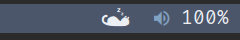
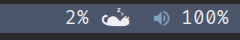

# polycat <a id="polycat"></a>
runcat module for polybar (or waybar)

## Table of Contents <a id="table-of-contents"></a>
- [Polycat](#polycat)
- [Table of Contents](#table-of-contents)
- [Usage](#usage)
- [Features](#features)
    - [Configuration](#features-configuration)
    - [Command-line arguments](#features-arguments)

## Usage <a id="usage"></a>
- Install the font
```console
foo@bar:~$ git clone https://github.com/2IMT/polycat.git
foo@bar:~$ cd polycat/res
foo@bar:res$ cp runcat.ttf ~/.local/share/fonts/runcat.ttf
```
- Place the executable in **~/.config/polybar/modules** directory (or any other)
- Add the module to your polybar config:
```ini
[module/polycat]
type = custom/polycat
exec = ~/.config/polybar/modules/polycat --config-path ~/.config/polybar/modules/polycat-config.json
tail = true
```
- Place the module where you want
```ini
[bar/your-bar]
...
; modules-left = ... polycat ...
modules-right = ... polycat ...
...
```
Here you go


## Features <a id="features"></a>
### Configuration <a id="features-configuration"></a>
Polycat is configured with json file usually placed in the working directory of polycat (config path is specified using [command-line arguments](#features-arguments)).

If config file doesn't exist, polycat automatically creates the empty config file.

#### Default configuration values
```json
{
    "frames": "",
    "lowRate": 2,
    "highRate": 30,
    "pollingPeriod": 1000,
    "smoothEnabled": true,
    "smoothValue": 2000,
    "sleepEnabled": true,
    "sleepThreshold": 8,
    "wakeupThreshold": 12,
    "sleepFrames": "",
    "sleepRate": 4,
    "formatEnabled": false,
    "format": "$frame $lcpu"
}
```

- `frames` (non-empty string) 
sets the frames to loop through.
- `lowRate` (number [1-255] inclusive) 
sets the FPS minimum.
- `highRate` (number [1-255] inclusive) 
sets the FPS maximum.
- `pollingPeriod` (number >1)
sets the period of polling the CPU (stat file).
- `smoothEnabled` (boolean) 
enables smooth transition between CPU load values.
- `smoothValue` (num [1-10000] inclusive) 
number of milliseconds required to transition from 0% to 100%.
- `sleepEnabled` (boolean) 
enables sleeping.
- `sleepThreshold` (number [1-100] inclusive) 
sets the maximum CPU load needed to transition from active mode to sleeping mode.
- `wakeupThreshold` (number [1-100] inclusive, >sleepThreshold) 
sets the minimum CPU load value needed to transition from sleeping mode to active. mode
- `sleepFrames` (non-empty string)
sets the frames to loop through in sleeping mode.
- `sleepRate` (number [1-255] inclusive)
sets the FPS for sleeping animation.
- `formatEnabled` (boolean)
enables output formatting.
- `format` (string)
sets the output format. $frame - animation, $lcpu - left-aligned CPU load value, $rcpu - right-aligned CPU load value.
Note: always escape $ characters with $, otherwise an error will be thrown.

#### Sleeping


#### Output formatting


format string here: `"$rcpu $frame"`

### Command-line arguments <a id="features-arguments"></a>
By default, polycat uses /proc/stat file for CPU polling and polycat-config.json located in the working directory as a configuration file
Command-line arguments allow you to set the location of configuration file as well as the location of stat file
- `-c` or `--config-path` sets the path for configuration file
- `-s` or `--stat-path` sets the path for stat file

#### Example
```console
foo@bar:~$ ./polycat --config-path ./config-files/config.json --stat-path /proc/stat
```
In this example, the config file path would be **~/config-files/config.json** and stat path would be **/proc/stat**

